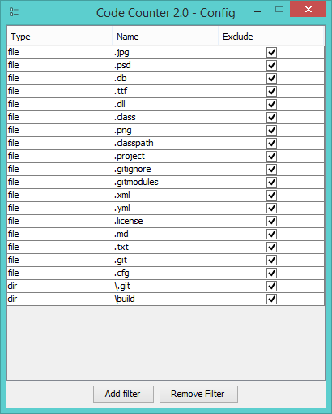

# Code-Counter - 
A Simple program that counts the lines of code in a directory

The program will count every directory and file, even if it will be excluded. It will just not count the lines

###Without Library

###With Library

###Config

