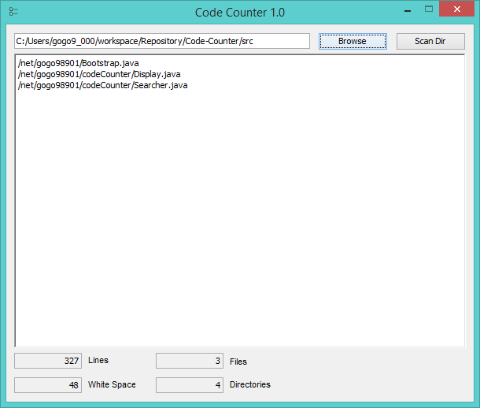

# Code-Counter [](https://travis-ci.org/GOGO98901/Code-Counter)
A Simple program that counts the lines of code in a directory


Currently the exclude list contains. It can be found in [Searcher.java](src/net/gogo98901/codeCounter/Searcher.java#L17)
```java
private String[] exclude = new String[] { ".png", ".psd", ".db", ".ttf", ".dll", ".class" };
```



